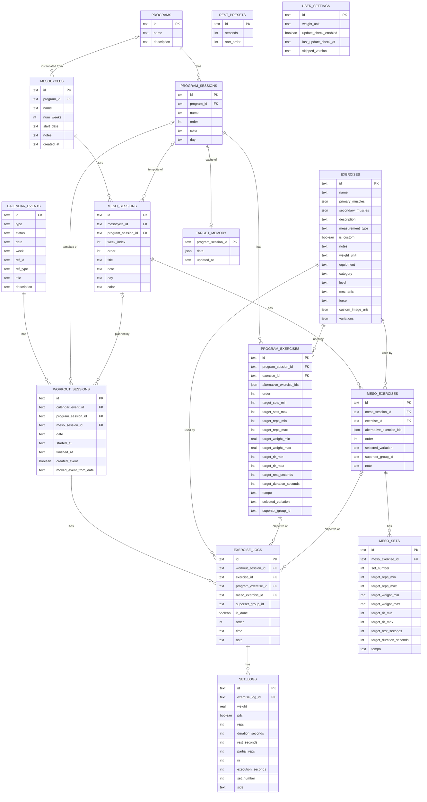

# Diagramme de la base de données

Diagramme Mermaid (`erDiagram`) reflétant `src/db/schema.ts`. **À tenir à jour** : voir la note dans `CLAUDE.md` (section Base de données) — toute session qui modifie le schéma (nouvelle colonne, nouvelle table, migration) doit régénérer ce fichier avant de terminer.

Dernière mise à jour : après la migration **0016** (`meso_exercises.note`, amélioration 06, 2026-08-26).

**Note :** `calendar_events.ref_id` n'est volontairement pas une vraie FK — il pointe soit vers un `program_session`, soit vers un `meso_session`, disambiguïsé par `ref_type` (voir section « Ancrage calendaire » de `CLAUDE.md`). C'est pour ça qu'il n'apparaît pas dans les relations ci-dessus.
